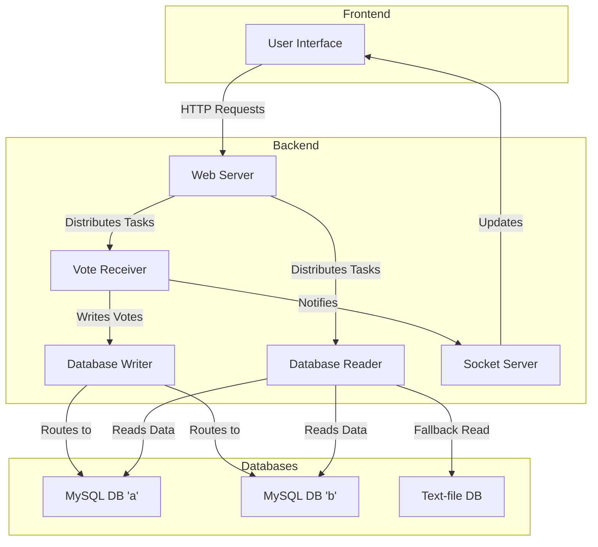

# System Architecture

The system is designed using a microservices architecture, which breaks down the application into smaller, independent services. This approach offers several advantages, including improved scalability, fault tolerance, and ease of maintenance.

## Architecture Diagram

The following diagram illustrates the overall architecture of the system:

## Design Choices

### Microservices Architecture

We chose a microservices architecture to decouple the different functionalities of the application. This allows us to develop, deploy, and scale each service independently. For example, the `Vote Receiver` service can be scaled separately from the `Database Reader` service to handle high loads during peak times.

**Alternative:** A monolithic architecture would have been simpler to develop initially, but it would have been much harder to scale and maintain in the long run.

### Load Balancing

The system uses a simple but effective load balancing strategy based on the game PIN. Even PINs are routed to one database instance, and odd PINs to another. This distributes the load evenly across the two databases.

**Alternative:** A more sophisticated load balancing strategy, such as round-robin or least connections, could have been used. However, our current approach is sufficient for the expected load and is much simpler to implement.
