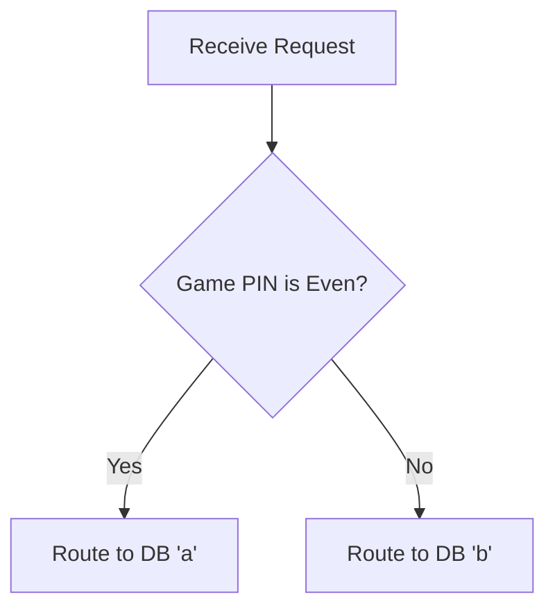

# Flowchart: Database Router

This flowchart explains the logic of the database router and how it selects between the two database instances.

```mermaid
graph TD
    A[Receive Request] --> B{Game PIN is Even?};
    B -- Yes --> C[Route to DB 'a'];
    B -- No --> D[Route to DB 'b'];
```
