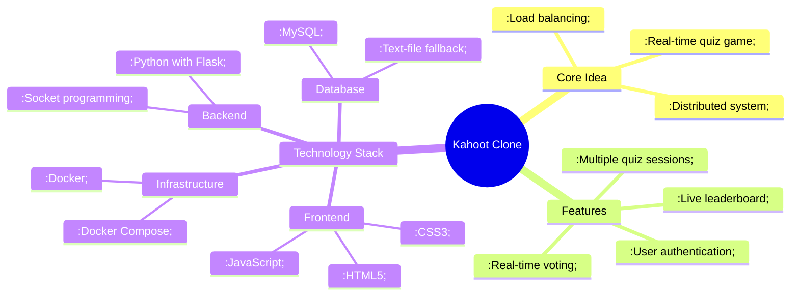

# Project Overview

This project is a real-time quiz game platform, similar to Kahoot, built with a distributed systems approach. It is designed to handle multiple concurrent users and ensure high availability through a microservices architecture and load balancing.

## Mindmap

Here is a mindmap that provides a high-level overview of the project's concept, features, and technologies:

