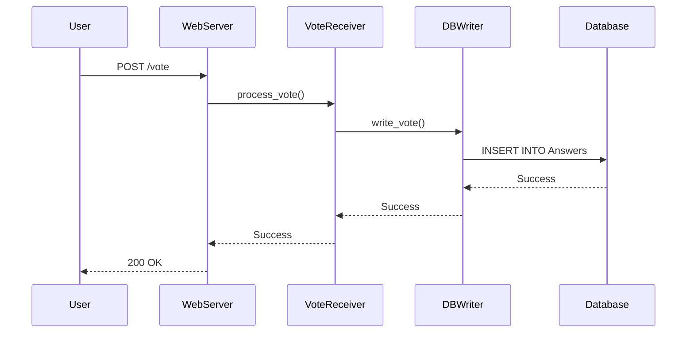

# Sequence Diagram: Vote Submission

The following sequence diagram illustrates the process of submitting a vote, from the user's action to the database write operation.

```mermaid
sequenceDiagram
    participant User
    participant WebServer
    participant VoteReceiver
    participant DBWriter
    participant Database

    User->>WebServer: POST /vote
    WebServer->>VoteReceiver: process_vote()
    VoteReceiver->>DBWriter: write_vote()
    DBWriter->>Database: INSERT INTO Answers
    Database-->>DBWriter: Success
    DBWriter-->>VoteReceiver: Success
    VoteReceiver-->>WebServer: Success
    WebServer-->>User: 200 OK
```
