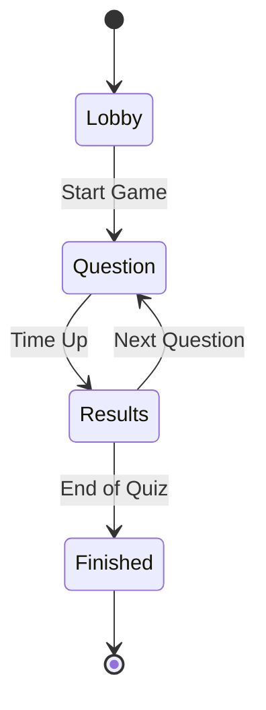

# State Diagram: Game Session

This state diagram represents the different states of a game session, from its creation to its completion.

```mermaid
stateDiagram-v2
    [*] --> Lobby
    Lobby --> Question: Start Game
    Question --> Results: Time Up
    Results --> Question: Next Question
    Results --> Finished: End of Quiz
    Finished --> [*]
```
